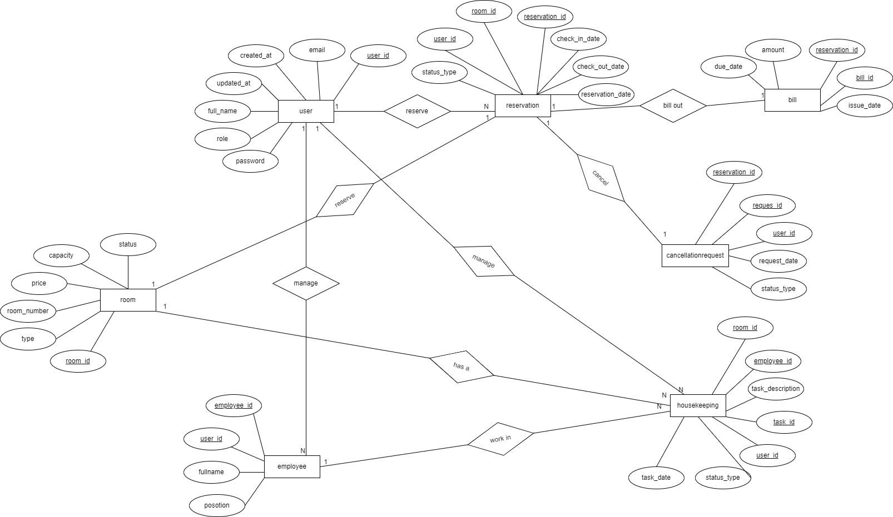

# Hotel Management System

## By Bader Manasra & Aisha Qadi

The Hotel Management System is designed to streamline operations for both hotel employees and guests. It offers functionalities such as searching for available rooms, reservations, customer check-ins and check-outs, and invoice generation. Employees can manage room availability, maintain customer profiles, and oversee housekeeping schedules.

## Table of Contents

- [Project Overview](#project-overview)
- [Features](#features)
- [Technologies Used](#technologies-used)
- [ER Diagram](#er-diagram)
- [Description for each resource](#description-resource)
- [Docker Instructions](#docker-instructions)
- [run the application with its database using docker-compose](#docker-compose)
- [Learnings](#learnings)
- [Contributors](#contributors)

## Project Overview

1. **Backend Implementation**:
   - Customer management: User registration, login, profile management.
   - Employee management: Admin management of hotel employees.
   - Search functionality: Search for reservations, customer info, and available rooms.
   - Reservation functionality: Booking, modifying, and canceling reservations.
   - Room management: Managing room types, availability, and status.
   - Check-In/Check-Out: Managing customer arrivals and departures.
   - Housekeeping management: Scheduling and tracking housekeeping tasks.
   - Billing functionality: Generating and managing invoices.
   - Role-based access control: Different functionalities based on user roles (admin, customer).
   - Database design: Based on the tutorial at [YouTube Tutorial](https://www.youtube.com/watch?v=pYYmvaKy-yQ).

2. **Docker Setup**:
   - we Create  Docker image for the application and push it to DockerHub.
   - we use `docker-compose` to run the application with its database.

3. **GitHub Repository**:
   - Repository: `project2-hotel-management-system`
   

4. **Code Documentation**:
   - we use OAS 3.1.0 to document APIs.
   - we Implement entity relations in the DAO layer.
   - we Secure APIs using JWT.
   - we make API versioning.

5. **Postman Collection**:
   - we prepare a Postman collection to simulate user journeys.
   - we export and push the Postman collection to GitHub.

6. **Database Initialization**:
   - we initialize the database structure, populate initial data, and generate samples.

7. **Data Validation and Exception Handling**:
   - we implement proper data validation and exception handling.

## Features

- **Customer Management**: Register, login, and manage user profiles.
- **Employee Management**: Admin functionality to manage hotel employees.
- **Search Functionality**: Search reservations, customer info, and available rooms.
- **Reservation Management**: Book, modify, and cancel reservations.
- **Room Management**: Manage room types, availability, and status.
- **Check-In/Check-Out**: Handle customer arrivals and departures.
- **Housekeeping Management**: Schedule and track housekeeping tasks.
- **Billing**: Generate and manage invoices.
- **Role-Based Access Control**: Different functionalities for admin and customer roles.

## Technologies Used

- **Spring Boot**: For backend implementation.
- **mySQL Database**: For database implementation.
- **Docker**: For containerization and deployment.
- **JWT**: For securing APIs.
- **Postman**: For API testing and documentation.
- **OpenAPI (OAS) 3.1.0**: For API documentation.

## ER Diagram

## resources Description

### User
- **Attributes**:
  - `user_id`: Unique identifier for the user.
  - `email`: Email address of the user.
  - `full_name`: Full name of the user.
  - `password`: Password for user authentication.
  - `role`: Role of the user (admin or customer).
  - `created_at`: Timestamp when the user was created.
  - `updated_at`: Timestamp when the user was last updated.
- **Relationships**:
  - One-to-Many with `reservation` (a user can have multiple reservations).
  - One-to-Many with `cancellationrequest` (a user can make multiple cancellation requests).
  - One-to-One with `employee` (a user can be an employee).

  ### Room
- **Attributes**:
  - `room_id`: Unique identifier for the room.
  - `room_number`: Room number.
  - `type`: Type of the room (e.g., single, double).
  - `capacity`: Capacity of the room.
  - `price`: Price of the room per night.
  - `status`: Availability status of the room.
- **Relationships**:
  - One-to-Many with `reservation` (a room can be reserved multiple times).
  - One-to-Many with `housekeeping` (a room can have multiple housekeeping tasks).

  ### Reservation
- **Attributes**:
  - `reservation_id`: Unique identifier for the reservation.
  - `check_in_date`: Check-in date for the reservation.
  - `check_out_date`: Check-out date for the reservation.
  - `reservation_date`: Date when the reservation was made.
- **Relationships**:
  - Many-to-One with `user` (a reservation is made by one user).
  - Many-to-One with `room` (a reservation is for one room).
  - One-to-One with `bill` (each reservation generates one bill).
  - One-to-One with `cancellationrequest` (a reservation can have one cancellation request).

### Bill
- **Attributes**:
  - `bill_id`: Unique identifier for the bill.
  - `reservation_id`: Identifier for the associated reservation.
  - `amount`: Total amount of the bill.
  - `issue_date`: Date when the bill was issued.
  - `due_date`: Due date for bill payment.
- **Relationships**:
  - One-to-One with `reservation` (each reservation generates one bill).

### CancellationRequest
- **Attributes**:
  - `request_id`: Unique identifier for the cancellation request.
  - `reservation_id`: Identifier for the associated reservation.
  - `user_id`: Identifier for the user who made the request.
  - `request_date`: Date when the cancellation request was made.
  - `status_type`: Status of the cancellation request (pending, approved, rejected).
- **Relationships**:
  - Many-to-One with `reservation` (a cancellation request is for one reservation).
  - Many-to-One with `user` (a cancellation request is made by one user).

### Housekeeping
- **Attributes**:
  - `task_id`: Unique identifier for the housekeeping task.
  - `room_id`: Identifier for the room associated with the task.
  - `employee_id`: Identifier for the employee assigned to the task.
  - `task_description`: Description of the housekeeping task.
  - `task_date`: Date when the task is to be performed.
  - `status_type`: Status of the task (pending, completed).
- **Relationships**:
  - Many-to-One with `room` (a housekeeping task is for one room).
  - Many-to-One with `employee` (a housekeeping task is assigned to one employee).

### Employee
- **Attributes**:
  - `employee_id`: Unique identifier for the employee.
  - `user_id`: Identifier for the associated user.
  - `full_name`: Full name of the employee.
  - `position`: Position of the employee in the hotel.
- **Relationships**:
  - One-to-One with `user` (an employee is associated with one user).
  - One-to-Many with `housekeeping` (an employee can be assigned multiple housekeeping tasks).

## Docker Instructions

### 1-create docker file in our project like :

FROM openjdk:17-jdk-alpine  //java version

WORKDIR /app 

COPY target/proj-app.jar /app/proj-app.jar // copy jar file

EXPOSE 8080 //port

ENTRYPOINT ["java", "-jar", "proj-app.jar"] 

### 2-Build and Package the Application:
in mvn we run this command : ./mvnw clean package

### 3-Run the Application:
in terminal of our dirictory we run this command : 

java -jar target/hotel-management-system-0.0.1-SNAPSHOT.jar 

this command will create jar file.

### 4-Build Docker Image:

docker build -t badermanasra07/hotel-management-system .

### 5-Push Docker Image to DockerHub:

docker push badermanasra07/hotel-management-system

## run the application with its database using docker-compose.

### 1- create a docker-compose.yml File
this file like this :

version: '3.8'

services:

  db:

    image: mysql:8.0

    environment:

      MYSQL_DATABASE: hotel_db

      MYSQL_USER: user

      MYSQL_PASSWORD: password

      MYSQL_ROOT_PASSWORD: root_password

    ports:

      - "3306:3306"

    volumes:

       - db_data:/var/lib/mysql

  app:

    image: badermanasra07/
    hotel-management-system

    ports:

        - "8080:8080"

    depends_on:

         - db

    environment:

         SPRING_DATASOURCE_URL: jdbc:mysql://db:3306/hotel_db

         SPRING_DATASOURCE_USERNAME: user

         SPRING_DATASOURCE_PASSWORD: password

         SPRING_JPA_HIBERNATE_DDL_AUTO: update

volumes:

       db_data:

## Learnings

Throughout the development of the Hotel Management System, we have gained valuable insights and experience in various aspects of software engineering and project management. Here are some of the key learnings from this project:

1. **Spring Boot Framework**:
   - We gained hands-on experience in building  application using the Spring Boot framework. This included setting up the project, creating RESTful APIs, and managing dependencies using Maven.

2. **Database Design and Management**:
   - We learned how to design and implement a relational database schema using MySQL. This involved creating entity relationships, setting up foreign keys, and ensuring data integrity.

3. **Docker and Containerization**:
   - We learned how to containerize the application using Docker. This included creating Dockerfiles, building Docker images, and using Docker Compose to manage multi-container applications. This knowledge is crucial for deploying applications in a consistent and portable manner.

4. **API Security with JWT**:
   - Implementing JSON Web Tokens (JWT) for securing APIs was an important learning experience. We understood the concepts of token-based authentication, generating tokens, and validating them to protect endpoints.

5. **Role-Based Access Control (RBAC)**:
   - We implemented role-based access control to manage different levels of access for admin and customer users. This included configuring security settings and managing user roles within the application.

6. **API Documentation with OpenAPI**:
   - Using OpenAPI (OAS 3.1.0) to document our APIs was a valuable exercise. We learned how to generate API documentation from the code, ensuring that our APIs are well-documented and easy to understand for other developers.

7. **Postman for API Testing**:
   - We created a comprehensive Postman collection to test our APIs and simulate user journeys. This helped us validate the functionality of our endpoints and ensure that they work as expected.

8. **Database Initialization and Data Seeding**:
   - We learned how to initialize the database with required structures and seed it with initial data. This was important to ensure that the application has the necessary data to function correctly during testing and deployment.

9. **Data Validation and Exception Handling**:
   - Implementing proper data validation and exception handling was crucial for building a robust application. We learned how to handle various edge cases and provide meaningful error messages to users.

10. **Version Control with Git and GitHub**:
    - Using Git for version control and GitHub for collaboration taught us the importance of maintaining a clean commit history, creating meaningful commit messages, and managing branches and pull requests effectively.

11. **Collaboration and Teamwork**:
    - Working in a team of two, we learned how to collaborate effectively, divide tasks, and manage our time to ensure the project was completed successfully. Communication and coordination were key to our success.

12. **Project Documentation**:
    - Documenting the project in the README.md file, including setup instructions, resource descriptions, and our learnings, emphasized the importance of clear and comprehensive documentation for future reference and for other developers who may work on the project.

Overall, this project provided us with a well-rounded experience in backend development, from backend implementation to containerization, security, and documentation. These skills are invaluable for our future endeavors in software development.

       

